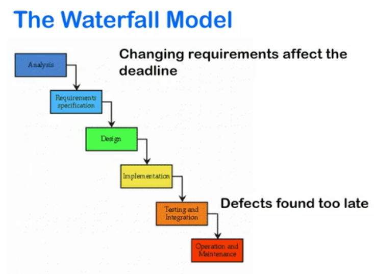
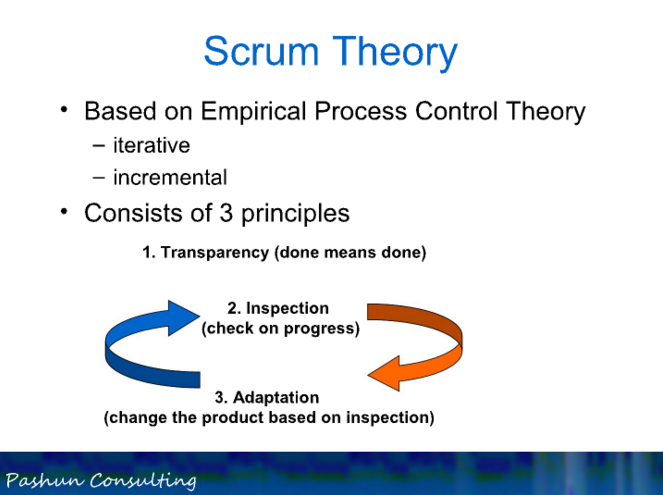
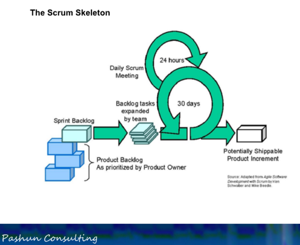

# Agile Scrum

## Intro
- Method for managing and completing project
- Helps deliver project on time
- Scrum certification: [scrum.org]()
- Scrum Master | Team Lead | Technical Lead
- Sprint, Sprint Planning Meeting, Spring Review, Working Increment
- If you understand “Scrum Guide”, you understand scrum
    - Download Scrum Guide here: [http://www.scrumguides.org/download.html]()

## World before Agile & Scrum : The Waterfall Model
- Consist of upfront contiguous phases
- Processes flows neatly from one to another, like a waterfall

- However, there are some fundamental flaws:

- Some other obstacles waterfall model has to deal with:
    - Unclear requirement
    - Unrealistic expectations (deadline, estimates, scope)
    
In Scrum, above waterfall issues known as **blockers**. Collectively, thus blockers can make chaos in project. Group of leaders joint forces and recognize thus blockers. They created new iterative agile method of working. One such method was Scrum. 

## Working in iterations: Advantages
- Allows business flexibility to change requirements
- Gives development team certainty within iteration

## The Birth of Agile
- Started in 90's
- Agile is not Scrum
- Agile that similar to Scrum: XP, Crystal, DSDM, FDD

> Agile is a set of methodology and framework that share a manifesto and set of principles. Scrum is one such framework.

## Scrum

In Scrum Guide, Scrum defined as a framework for developing and sustaining complex product.

### Consist of *self-organising cross functional* teams
The teams consist of a group of people, each has different area of expertise but work together for the same outcome.

>Scrum Teams are self-organizing and cross-functional; which is very different from traditional development groups.

Project manager does not control them since their expertise empowers them to make decision collectively.

> Scrum named after an analogy to rugby where a team work together in a chaotic environment to keep control of a ball.

Sample of initial product backlog:

*Building feature, from a user's perspective:*

1. **As a** user
2. **I want** a News Page
3. **So that** I can see the top 10 news stories

### Theory
- Imperical process control theory
    - **Transparency** : done means done, honesty
    - **Inspection** : check on progress
    - **Adaptation** : change the product based on inspection

## Scrum in Nutshell

### Roles
- ***Scrum Master***
    - Understands scrum rules and practices
    - Responsible for removing impediments to delivery
    - Helps team understand how to self-organize and work in a scrum manner
- ***Product Owner***
    - Creates requirements on behalf of business
    - Prioritizes as per business needs
    - Responsible for managing product backlog
- ***Team***
    - Create each increment of shippable product
    - Self-organizing
    - Collaborative
    - Optimum size of 3 to 9
    - Skilled in whatever is needed for project, eg. design, Java, sql, information architecture, etc.

> Optimal Development Team size is small enough to remain nimble and large enough to complete significant work. Fewer than three Development Team members decreases interaction and results in smaller productivity gains. More than nine members simply requires too much coordination.

### Rules & Time Boxes
- Sprint
- Sprint Planning Meeting
- Sprint Review
- Sprint Retrospective
- Daily Scrum

### Artifacts
- Product Backlog
- Sprint Backlog
- Increment of potentially shippable product functionality

### Skeleton

## Working Increment
- Deployable to the live system (*potentially* shippable)
- Collection of all features in the sprint

## FAQ
- *Who should attend scrum event?*  
  The key is to look to the Scrum Guide and where Scrum Team are mentioned, all must attend. 

    Example for events & its attendees:
    
    - **Scrum planning**:  
    The Scrum Team (PO, Dev Team and SM) must all attend. Each plays a role in crafting the plan.
    - **Scrum review** :  
    The Scrum Team (PO, Dev Team and SM) must all attend with Stakeholders.
    - **Scrum retrospective** :  
    The Scrum Team (PO, Dev Team and SM) must all attend
    - **Daily scrum** :  
    only development team is needed (SM / PO not obligatory to attend). The SM must facilitate: Often means attending, however it is not compulsory. It's recommended for the PO to attend to be observe but again, it is not compulsory.

---
- image credit to pasun from udemy.com: https://www.udemy.com/scrum-certification/learn/#/lecture/2043976