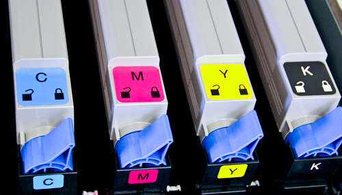
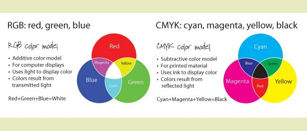
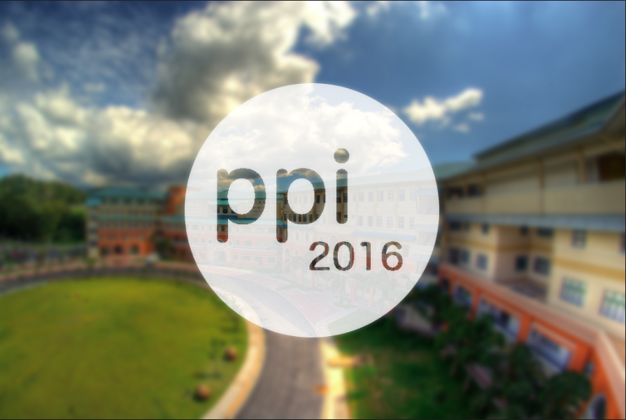

# Photoshop : The Basic

- pixel based, not vector based
- vector-based : corel, AI
- know the difference between CMYK and RGB
- what is dpi?
- layer, layer style, filter
- shortcut is your friend

### Common Tools
- crop
- straighten
- cut
- selection & invert
- trim
- smooth
- wand
- pen
- color picker

### freepik
- http://www.freepik.com/free-vector/abstract-shapes-electro-party-poster_847754.htm
- http://www.freepik.com/free-vector/colored-quote-frame-collection_847411.htm
- http://www.freepik.com/free-vector/flat-speech-bubbles-set-with-text_845670.htm