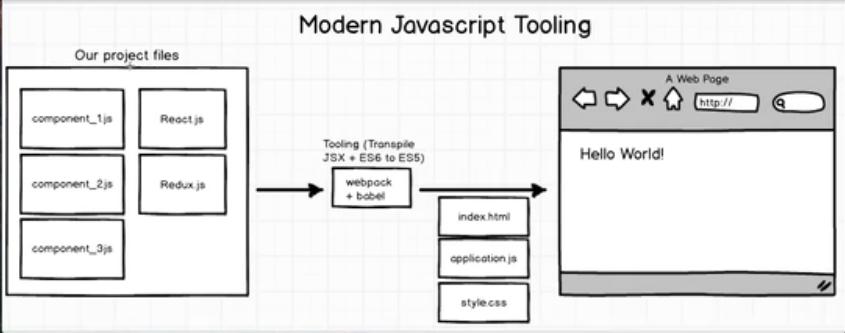

# Redux

Basic steps:
- Project files
- Tooling. Output: index.html, application.js, style.css
- Display in browser

>Common Steps:
- `npm install` to install dependencies
- `npm start` to run the start script  
*Dependencies and start script defined in `package.json`*

Components are snippet of code that produce HTML.

The role of webpack and babel is to convert our jsx code into vanilla javascript which browser can understand.

- So why use jsx in the first time?  
To make our code more elligible. Try write a code in jsx and compare to its vanilla javascript version here https://babeljs.io/repl/.

Using javascript module: don't forget to import the component before using it.

- Differentiate between component class & instance
