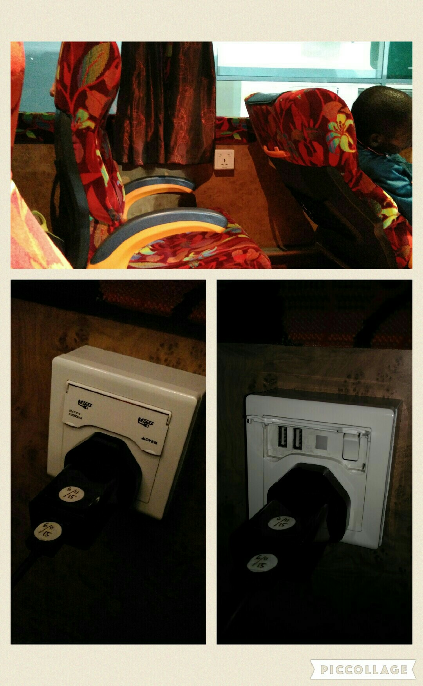
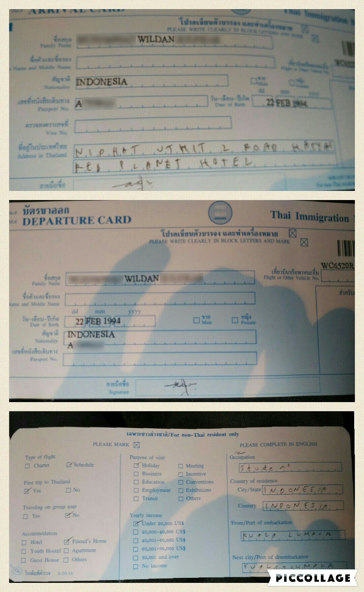
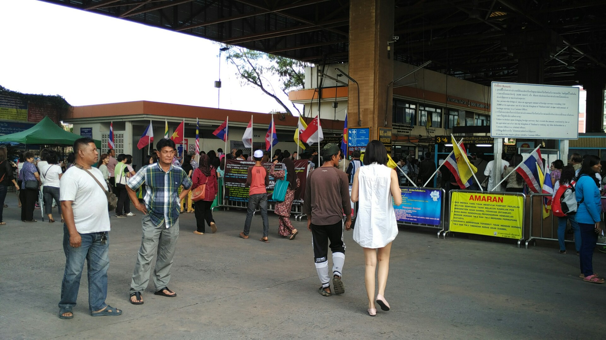
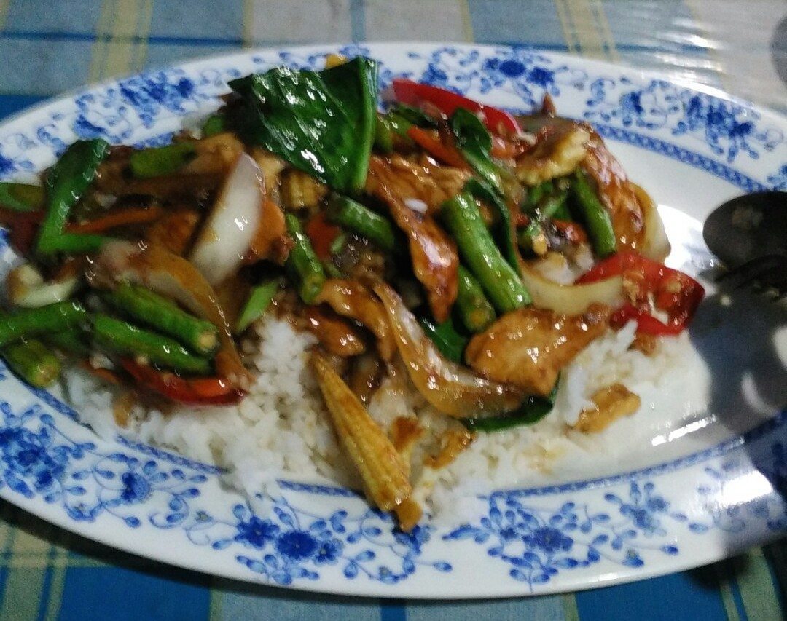

# My First Trip to Thailand

Thailand Trip - 2d 1n

- satun
- krabi
- pukhet
- hatyai ✔
- pattani ✔

Departed from TBS at 23.39, heading to Hatyai, Thailand. I was the last person to check-in, the bus should be departed by 11.30 as in ticket. The ticket cost me RM 55, and the bus company was Intertop (Pudu).

Since i booked the ticket online (from easybus.com) I'd to exchange the booking code with boarding pass in the counter. It was either counter B or C. Counter C closed, counter B has about 3 people in queue.

Thought I would miss the bus, but luckily random Malay girl waering red baju kurung in the queue allowed me to go first. She asked, "urgent?" i told her yes. Thanks a lot, sister!

I reached the counter and asked the clerk, "can i still catch the bus?", he checked my boarding code, and directly raised his walkie talkie asking a person at the other end if the bus still waiting.

"Yes, please go to gate 10" said the clerk. I was surprised, and grateful indeed. I turn around, faced the girl who helped me to go first, and told her "Thank you!" and ran to the departure gate.

As i ran to departure gate, i told my self, "if i have chance at any given time in my life, I'll do the same as that girl did to me". She observed me as i came in rush, and gave me her help. For me, it was touching.

As i expected, i was the only one who didn't ride the bus. Went to the gatekeeper to check my boarding pass, rode the bus, and finally, a trip to Hatyai!

Really glad that the bus has electric plug so i can charge my phone. Nice!

***July 16, Morning.***
Bus stopped at chang loon, around 6.30. The bus staff took my passport, he would do some immigration related stuffs. We stopped there a few over an hour. I slept in my seat.

Other passenger woke me up, telling me that the passport were ready to be taken in a little plastic box. I took my passport and there were this immigration card which then i filled the blanks with my pen.

A while after, a man stood in front of me, asking if i had a pen. I told him yes. Not for long, he asked me if i was a student at Thailand, using Indonesian language (my mother tongue). Well, nice to meet you my fellow Indonesian!

His name is Faris, has been working in Thailand for a year as English teacher in a high school in Pattani. His origin is Mojokerto, which is around 2 hours driving from my home, Surabaya. From here, i think I'll change my plan from exploring Hatyai to exploring Pattani.

Departed from thailand immigration, danok to hatyai at 9.12am after dealing with immigration stuffs about an hour. I wouldn't recommend visiting thailand via bus if you go with elderly people because the queue is quite exhausting.

We arrived at hatyai around 11

Arrived at pattani downtown around 17.00, the place of mas faris. There's another guy there, mas imam who's also indonesian, tulung agung to be exact.

Another paprik rice for dinner:

*to be continued..*