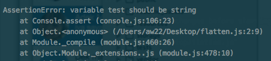

# Auto Re-Run with Nodemon

https://github.com/remy/nodemon#nodemon

- Install nodemon globally : `npm install -g nodemon`

- Create new file `hiNodemon.js` which contain below code:
```js
var test = 'Hi nodemon!';
console.assert(typeof test == 'string', 'variable test should be string');
console.log(test);
```

- To start watching `hiNodemon.js`, type:  
  `nodemon path/to/hiNodemon.js`

## Checking if it works
Change value of `test` variable inside `hiNodemon.js` to non-string and `nodemon` will automatically re-run the file and output something like:



Tags: `TDD` `NodeJS`