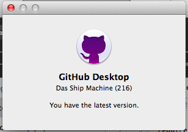
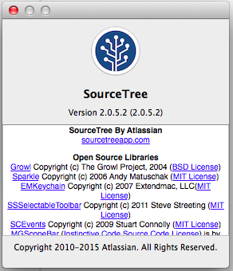
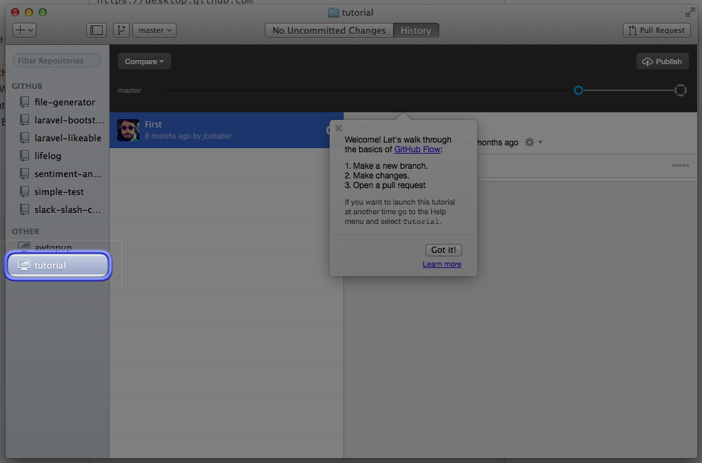

# From Source Tree to GitHub Desktop

https://desktop.github.com

Outline:
- been using sourcetree for ~6 months.
- Was using GitHub Desktop, for like 1 week. It was very heavy on my machine so I uninstalled it. Tried to install it again, like, one week ago. Not sure why, but now it feel really light and fast, even compared to SourceTree.

GitHub Desktop:
- Has built-in tutorial

images:
- 
- 
- 

