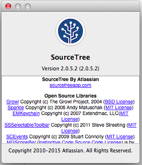
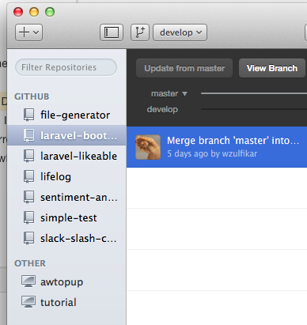
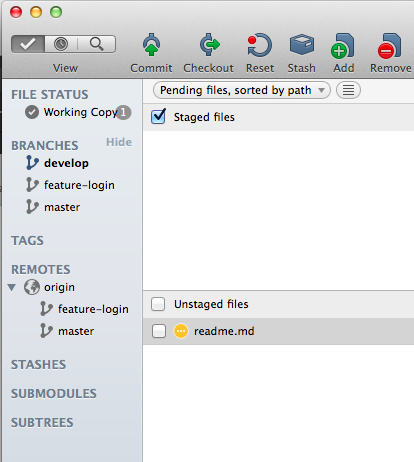

# From Source Tree to GitHub Desktop
*(first outline)*

https://desktop.github.com

Outline:
- been using sourcetree for ~6 months.
- Was using GitHub Desktop, for like 1 week. It was very heavy on my machine so I uninstalled it. Tried to install it again, like, one week ago. Not sure why, but now it feel really light and fast, even compared to SourceTree.
- I was thinking that GitHub Desktop was created only for repository hosted in GitHub, Lol.
- While using SourceTree, I used to open multiple tabs for my multiple repository that I was working on. Using GitHub Desktop, I only need one tab, which is the app itself since all my repositories are listed in the sidebar.
- Using GitHub Desktop, it's easier to navigate between repos since its sidebar has list of our repos, categorized as “GitHub” & “Other” (non-GitHub).

GitHub Desktop:
- Has built-in tutorial

Sites:
- https://desktop.github.com
- https://www.sourcetreeapp.com

images:
- 
- 
- 
- 
- 

