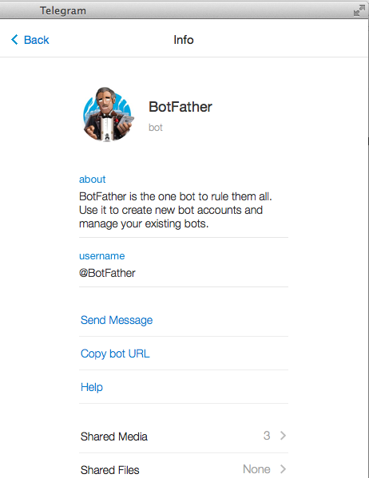

# Telegram Bot

*Official Documentation: [https://api.telegram.org/bots]()*.

Another messaging platform [Telegram](https://telegram.org) that offer programmable bot. The bot uses HTTP API is:

[https://api.telegram.org/bot{your_bot_token}/{commandName}]()

>You can find list of available command here: [https://core.telegram.org/bots#commands]().

### What I did to set up my first bot..
First thing to do is to talk to [BotFather](https://telegram.me/botfather) using your Telegram account.

Send him a message “`/newbot`” and then he'll guide you from there. To display things you can do with [BotFather](https://telegram.me/botfather), send him “`/help`”.