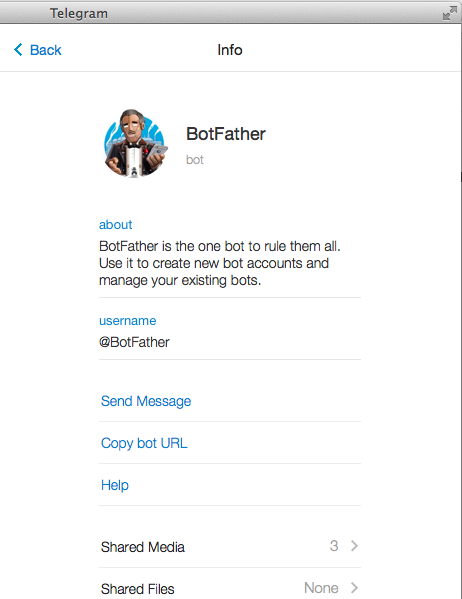

# Telegram Bot

*Official Documentation: [https://api.telegram.org/bots]()*.

Another messaging platform [Telegram](https://telegram.org) that offer programmable bot. The bot uses HTTP API, and its endpoint is:

>[https://api.telegram.org/bot{your_bot_token}/{commandName}]()

*You can find list of available command here: [https://core.telegram.org/bots#commands]()*

### What I did to set up my first bot..
First thing to do is to talk to [BotFather](https://telegram.me/botfather) using your Telegram account.



Send him a message “`/newbot`” and then he'll guide you from there. To display things you can do with [BotFather](https://telegram.me/botfather), send him “`/help`”.

Once the new bot is created, you can test it by visiting this url:

[https://api.telegram.org/bot{your_bot_token}/getMe]()

Using `getMe` command will return information about your bot. Something like this:

```json
{"ok":true,"result":{"id":"bot_id","first_name":"bot_first_name","username":"bot_username"}}
```

To test whether the bot can receive message, try sending a message to `@your_bot_name` from your telegram account then visit this url:

[https://api.telegram.org/bot{your_bot_token}/getUpdates]()

It will display things sent to your bot in JSON format.