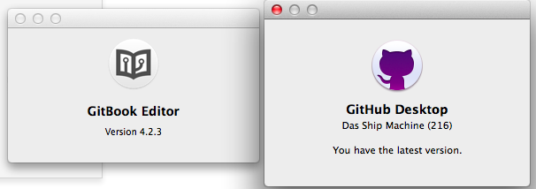
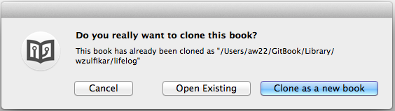
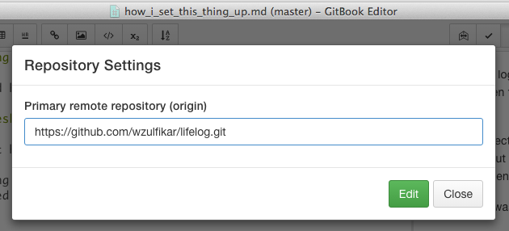

# How I set this thing up

I use OSX, 10.9.5 and have both Github Desktop and GitBook Editor installed. 

>To do this, you must have signed up with GitBook and Github.

First step was logging in to my GitBook account, clicked that __New Book__ button and then filled up necessary information for my GitBook (title, etc). Pretty easy.

Here, I can directly use GitBook web editor and start writing. But, what I wanted is to put files of my book in GitHub then trigger the push from GitHub to GitBook when changes happen.

My approach was:
- Create new GitHub repository (`wzulfikar/lifelog`)
- Link my GitHub repository to this GitBook (`Settings > GitHub`)
- Click __Add Webhook__ button

>Clicking __Add Webhook__ button will create new entry in your GitHub repository `Setting > Webhooks & services`.

In GitBook Editor, there was 2 tabs: **LOCAL LIBRARY** and **GITBOOK.COM**. Clicked **Life Log** in **GITBOOK.COM** tab then this dialog came:

After cloning the book -- *yes, I clicked that **Clone as a new book** button*, I opened it in GitBook Editor: **Local Library** tab. 

*The files are in my machine now.*

As I wanted to make GitHub repository as the origin, I open GitBook Editor **Help** (`command + shift + ?`) and searched for **Repository Setting**. There, I told GitBook Editor where to push.

Now, whenever I click that **Sync** button from GitBook Editor, it will push to `https://github.com/wzulfikar/lifelog.git`. From there, since we added the webhook, GitHub will push the update to GitBook. So, the flow is: `Local Machine -> GitHub -> GitBook`.

Honestly, I couldn't easily wrap my mind on how this GitBook work. A bit frustrated, but finally managed to make this up and running.
